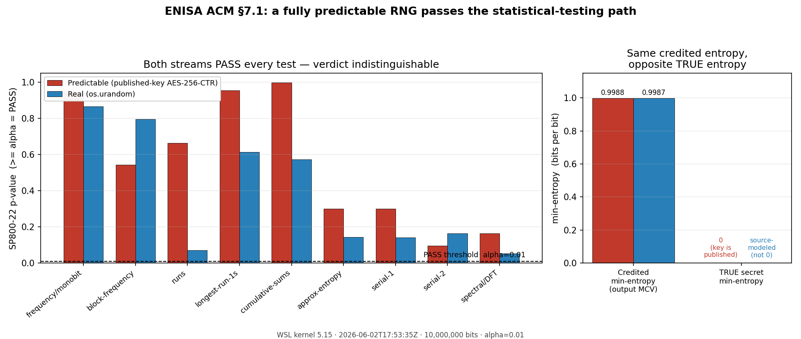

# ENISA ACM §7.1 — Why "statistical testing" must not be advised as a source-quality assessment method

**Target:** ENISA / ECCG *Agreed Cryptographic Mechanisms*, Section 7.1 *True Random Source*, first bullet ("Perform statistical tests on the output of the source"). References are to **published v2.0 (April 2025)**; the same text appears in the April 2026 working draft.

---

## 1. What §7.1 says

Section 7.1 offers **two approaches to assess the quality of the output of a true random source**:

1. **statistical testing** of the output (black-box), and
2. **modeling** the probabilistic process of the source (stochastic model).

The document itself concedes that the statistical approach "does not provide any assurance on the distribution of the output" and is "useful to detect unintentional failure of the random source." Despite that concession, statistical testing is still presented as one of the two co-equal **assessment** approaches, and Note 67-NoDirectRandomSource then only requires that a TRNG be used to seed a DRBG — it does not retract statistical testing as an assessment method.

## 2. The defect

> **Scope of this artifact.** The generator demonstrated here is intentionally **not** a true random source, and we do not claim it is one. It is a *counterexample*: a deterministic generator with fully public state, used to show that black-box statistical testing of output is insufficient as evidence of source quality. The expected objection — "this is not a probabilistic source, so §7.1 does not apply to it" — is precisely the point. §7.1's statistical-testing approach is handed bytes and asked to assess their quality; it cannot tell that those bytes come from a published-key cipher rather than a physical source. A method blind to that distinction must not be relied upon to establish source quality. The argument is about the *insufficiency of the method*, not about the artifact being a legitimate RNG.

A statistical battery measures one thing: whether output is **distinguishable from uniform by the specific tests in that battery**. It does **not** and **cannot** measure:

- unpredictability,
- min-entropy,
- independence from a known internal state.

A cryptographic PRG (e.g. AES-256-CTR) is *designed* to be statistically indistinguishable from uniform under any feasible test, while being **fully deterministic** given its key. Consequently a keystream produced from a **published** key:

1. **passes** the entire statistical battery, and
2. is **reproducible byte-for-byte** by anyone who holds the (public) key — i.e. it carries **zero** secret entropy.

Therefore **"passes statistical tests" ⇏ "is a sound true random source."** An evaluator or CISO who reads the §7.1 table and treats "statistical tests passed" as compliance evidence will accept a source with no entropy at all. Listing statistical testing as a source-quality *assessment* approach — even with the printed caveat — is exploitable and misleading.

This is not new at the level of principle (Håstad–Impagliazzo–Levin–Luby, 1999, formalises that a PRG's output is indistinguishable from uniform); the contribution here is to show it lands directly on the §7.1 text with a trivial, publicly reproducible artifact.

A sharper observation: **§7.1 does not even name a test battery.** It is therefore *strictly weaker* than AIS 31, whose Tirn black-box battery is fully specified. A construction already shown to pass the complete AIS 31 v3.0 Tirn suite (monobit, poker χ², MultiMMC, LZ78Y) from a printed key — see `github.com/owlmt/ais31-full-evaluation`, `predict_streamB.py` — *a fortiori* satisfies §7.1's unspecified "perform statistical tests." No new evidence is required to refute §7.1; the existing AIS 31 result already covers it.

## 3. Reproducible demonstration (this repository)

`predict_streamB_demo.py` emits an AES-256-CTR keystream from a **published** 256-bit key and 96-bit nonce. `battery.py` runs a FIPS/AIS31-style quick battery plus an 8-test subset of NIST SP800-22. `run_demo.sh` runs both on the predictable stream and on `os.urandom`.

Measured on 10,000,000 bits (α = 0.01). **Raw evidence logs are committed under `critique/evidence/`** (timestamped, with host/version provenance); reproduce with `run_demo.sh`.

> The **predictable** column is *deterministic*: because the key is published, these exact figures reproduce on every run, on any machine. The **os.urandom** column differs on every run by nature — a real source is not reproducible — so the values shown are from one representative run and are not expected to match yours. The invariant being demonstrated is the **verdict** (both PASS), not the os.urandom p-values.

| Test | Predictable (published-key AES-256-CTR) | os.urandom |
|------|------------------------------------------|------------|
| monobit (simple) | PASS (ones=5000105) | PASS (ones=5000268) |
| 4-bit poker (simple) | PASS (X=22.27) | PASS (X=15.99) |
| runs (simple) | PASS (z=0.43) | PASS (z=1.80) |
| longest-run (simple) | PASS (24) | PASS (23) |
| SP800-22 frequency/monobit | PASS (p=0.9471) | PASS (p=0.8654) |
| SP800-22 block-frequency | PASS (p=0.5439) | PASS (p=0.7951) |
| SP800-22 runs | PASS (p=0.6644) | PASS (p=0.0716) |
| SP800-22 longest-run-of-ones | PASS (p=0.9554) | PASS (p=0.6129) |
| SP800-22 cumulative-sums | PASS (p=0.9972) | PASS (p=0.5737) |
| SP800-22 approximate-entropy | PASS (p=0.2999) | PASS (p=0.1423) |
| SP800-22 serial (1,2) | PASS (0.2999, 0.0960) | PASS (0.1421, 0.1648) |
| SP800-22 spectral/DFT | PASS (p=0.1645) | PASS (p=0.0533) |
| output-MCV min-entropy (bits/bit) | 0.9988 | 0.9983 |
| **TRUE secret min-entropy** | **0 (key published)** | source-modeled (≠0) |

*Data from the real WSL run of 2026-06-02T17:53:35Z (kernel 5.15, Python 3.12.3), committed under `critique/evidence/`. The predictable column is deterministic and reproduces exactly on any machine; the os.urandom column is from that run and differs on every run by nature.*

*Figure: both streams clear the α=0.01 PASS line on every test (left); the predictable stream's credited min-entropy (0.9988) is indistinguishable from the real source's (0.9983), yet its TRUE secret min-entropy is 0 (right). Regenerate with `python3 make_diagram.py` (or `--self-run` to recompute from freshly generated streams).*

**Identical verdict.** The predictable stream is regenerable from the public key printed in `predict_streamB_demo.py`. (`battery.py` ships an **8-test subset** of NIST SP800-22, sufficient to demonstrate the effect; the full 15-test NIST STS is expected to give the same verdict, and the independently published AIS 31 v3.0 Tirn result at `github.com/owlmt/ais31-full-evaluation` confirms the predictor-based tests — MultiMMC, LZ78Y — also pass on this construction.)

## 3a. The same defect defeats ENISA's quantitative thresholds

ENISA states numeric randomness thresholds — DRBG seed min-entropy ≥125 bits (Note 68), ≥188 bits in quantum contexts (Note 69), CTR_DRBG key ≥192 bits (Note 71), symmetric keys ≥192 (Notes 3/19), hash output ≥384 (Note 4), MAC keys ≥192 (Note 19). These split into two kinds, and the predictable stream defeats **both**:

- **Entropy thresholds (seed ≥125 / ≥188).** Min-entropy can only be established by modeling the *raw noise source* (SP 800-90B) — never by tests on conditioned output. But §7.1 sanctions statistical testing of the output as an assessment approach, and an evaluator who follows it (or who runs an SP 800-90B estimator on the *output* rather than the raw source) gets a near-maximal estimate. Measured with the SP 800-90B 6.3.1 most-common-value estimator on the **output**: the published-key fake scores **0.9988 bits/bit** — statistically indistinguishable from `os.urandom` at 0.9983 — so a 256-bit draw is **credited ≈256 bits, clearing the ≥188-bit quantum bar**, while its **true secret min-entropy is 0** (the key is published). The threshold is *falsely credited*, not met.
- **Size thresholds (key ≥192, hash ≥384).** These are bit-length checks. AES-256 has a 256-bit key whether or not that key is secret, so the predictable construction **meets them by construction**. A key generated from the fake has the requested *size* but inherits **0 secret entropy**.

`entropy_claim_assessment.py` in this repository prints this contrast for any stream. The result: under ENISA's §7.1 statistical-testing path, **a fully predictable RNG would be assessed as clearing the quantitative randomness bar** — the entropy thresholds by *false crediting*, the size thresholds *by construction*. We never assert the fake "has" 188 bits of entropy; the precise statement is that ENISA's sanctioned assessment path would certify a zero-entropy source as meeting them. §7.1 itself concedes statistical tests give no distribution assurance — the point is that the structure still presents statistical testing as a source-quality *assessment* approach, which is what this counterexample targets.

## 4. Recommendation

Statistical testing should be **removed as a source-quality *assessment* method** in §7.1 and **demoted to its only sound role: runtime failure-detection (health/start-up tests) of a source whose quality has already been established by stochastic modeling.** This is exactly how statistical tests are scoped in:

- **AIS 31** — start-up and online (total-failure) tests, *not* the entropy assessment, which is done via the stochastic model; and
- **NIST SP 800-90B** — entropy is estimated by estimators run on the **raw noise source**, not by uniformity tests on conditioned output.

Concretely, the §7.1 first bullet should state that statistical tests serve only to detect operational failure of an already-modeled source and **provide no assurance of source quality or unpredictability**, and that source-quality assessment relies on approach 2 (modeling) together with an entropy-estimation methodology (AIS 31 / ISO 20543 / SP 800-90B).

---

# ECCG ACM update submission (Appendix C)

The following is drafted to the elements required by Appendix C of the document.

- **Contact of the submitter:** Mark Tehrani, CyberSeQ (madjid-tehrani).
- **Section / Quote:** §7.1 *True Random Source*, first bullet: *"Perform statistical tests on the output of the source… it does not provide any assurance on the distribution of the output of the random source… statistical tests are useful to detect unintentional failure of the random source."*
- **Category:** Incorrect content.
- **Update presentation (proposed new text):**
  > "Statistical tests on the output of a source may be used **only** as runtime failure-detection (start-up and online health tests) for a source whose quality has been established by modeling (approach below). They **do not provide any assurance of the quality, distribution, or unpredictability of the source** and **shall not be used as a method to assess source quality or to evidence compliance**: a fully deterministic generator (e.g. a block-cipher keystream from a known key) passes such tests while carrying no entropy. Source-quality assessment relies on modeling the probabilistic process together with an entropy-estimation methodology (e.g. AIS 31, ISO/IEC 20543, NIST SP 800-90B)."
- **Rationale and impact:** As shown above, the current wording lets "statistical tests passed" be read as compliance evidence, which a zero-entropy published-key generator satisfies. Removing statistical testing as an assessment method (retaining it only for failure detection) aligns §7.1 with AIS 31 and SP 800-90B and closes a certification gap that an evaluator could otherwise be misled by. Impact on industry is minimal: developers already run health tests; the change only forbids relying on them for source-quality claims.
- **References:**
  - Demonstration artifact: `github.com/owlmt/enisa` (`critique/`), and `github.com/owlmt/ais31-full-evaluation` (`predict_streamB.py`, full AIS 31 v3.0 Tirn pass from a printed key).
  - J. Håstad, R. Impagliazzo, L. A. Levin, M. Luby, *A Pseudorandom Generator from any One-way Function*, SIAM J. Comput. 28(4), 1999.
  - BSI AIS 31 v3.0 (functionality classes for RNGs); BSI *Documentation and Analysis of the Linux Random Number Generator*; NIST SP 800-90B.
